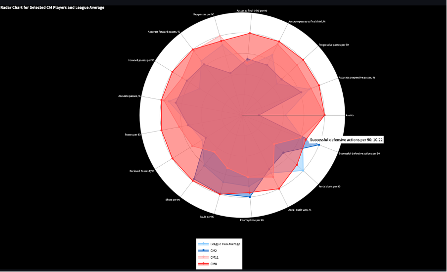
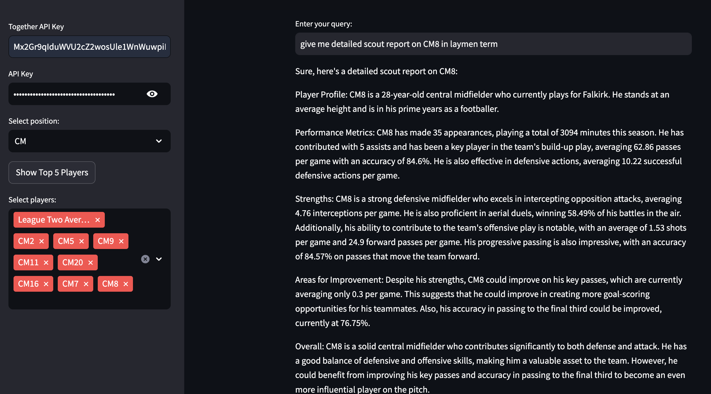
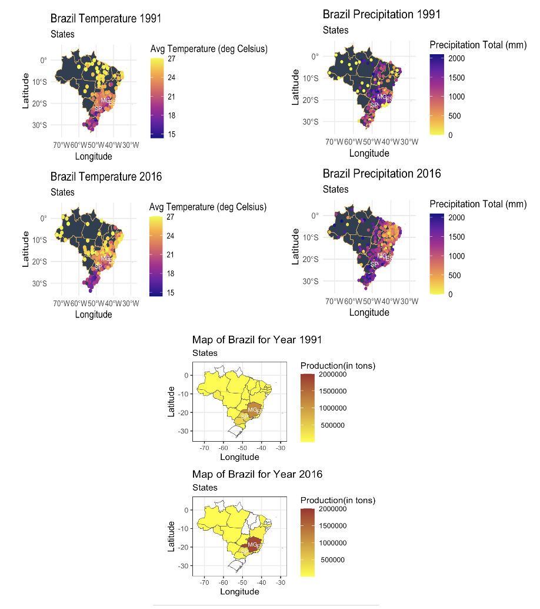
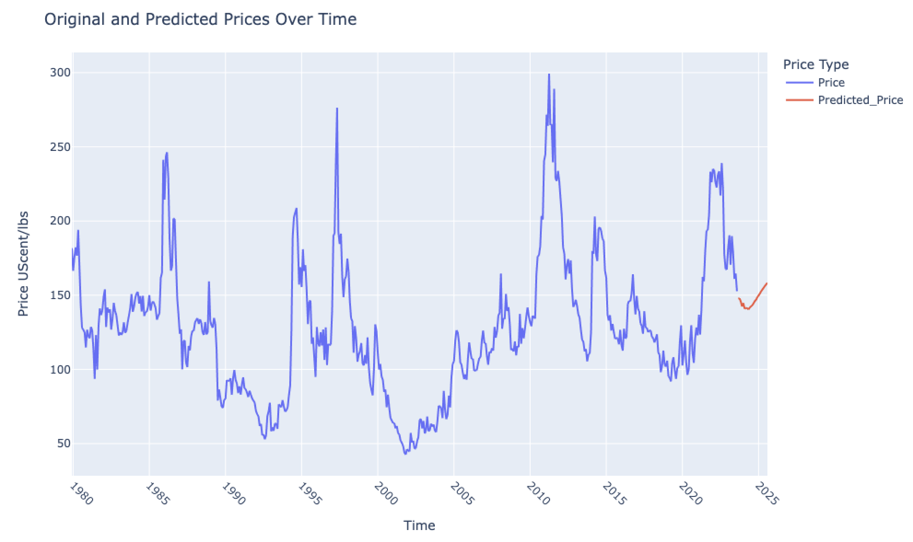
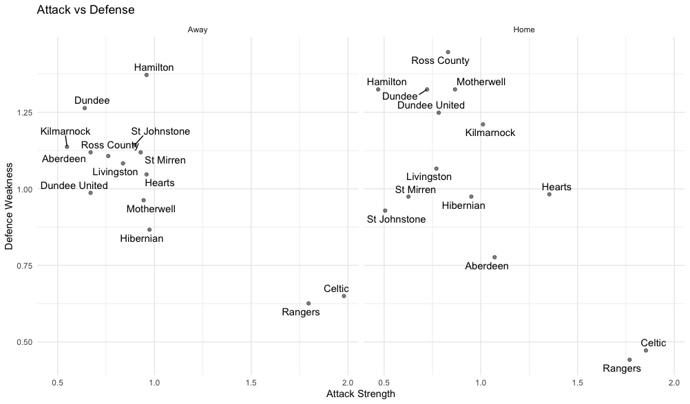
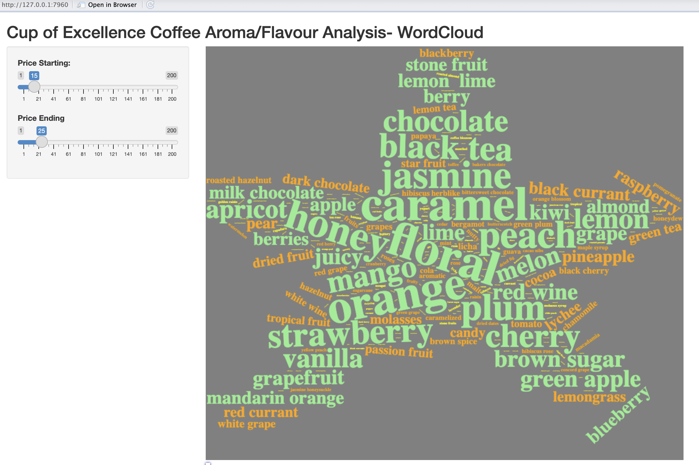
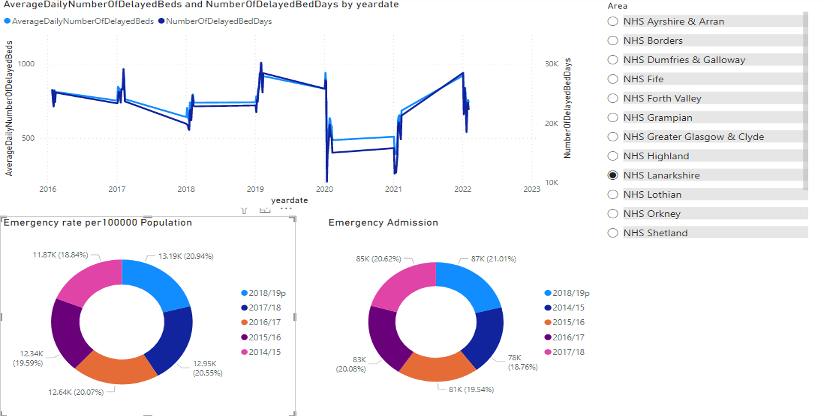

<nav style="padding: 10px;">
    

        

           <h1 style="margin: 0;">Data Analyst-Portfolio</h1>
        

        

            
                
            
            
                
            
        

    

</nav>

 
## Skills and Interests

  <strong>Programming:</strong> 
  Python (NumPy, matplotlib, pandas, Scikit-learn)
  SQL
  R (Shiny, Statistical Packages, ggplot2, rvest)
  Java
  C/C++
  DAX

 

  <strong>Skills:</strong> 
  Mathematics (statistics and probability)
  Data Visualisation
  Data mining and data QA
  Microsoft Azure
  Agile methodology
  SSIS/SSRS/SSAS
  Google Analytics
  NLP
  AI
  RAG
  LangChain
  Time series analysis (ARIMA, GARCH, LSTM)
  A/B Testing
  Problem-solving
  troubleshooting
  Business Acumen

 

  <strong>Domain:</strong> 
  Insurance
  Retail and Consumer Goods
  Financial
  Health
  Sports

 

  <strong>Tools and Technology:</strong> 
  Microsoft Office Suite (Dynamic 365, Power BI, Excel, etc.)
  SQL Server Management Studio
  Jira
  Guidewire
  NetLogo
  Jupyter
  Rstudio
  Visual Studio Enterprise
  Teradata
  Visio

 

  <strong>Interests:</strong> 
  Football
  Cricket
  Tennis
  Sports Analytics
  General Knowledge
  Political Science
  Stock Market

 

## Work Experience

### Data Analyst @ Elgin City FC (_June 2024 - Present_)

- Leverage WyScout data and utilise ML algorithm to identify high-potential player replacements, expecting significant improvement in team performance.
- Create visual comparisons of target players against league benchmarks using ggplot and radar plots, enhancing scouting efficiency.
- Developed performance analysis dashboards and conducted training sessions, resulting in a 10% increase in data-driven decision-making within the club.
- Integrating data from various scout reports to create visualizations that identify player strengths and weaknesses, with an expected 20% improvement in team decision-making.
- Developed an AI chatbot for scouts to interact with the dashboard utilizing the RAG pipeline.

  
  

  

### Data Analyst Internship @ Caribbean Goods Pvt. Ltd. (_May 2023_ - _December 2023_)

- Researched environmental factors affecting coffee sustainability in Brazil, Guatemala, Honduras, and Nicaragua.
- Analysed macroeconomic indicators to assess their influence on the prices of Coffee Future.
- Applied statistical and econometrics modelling techniques to achieve a mean absolute percentage error of less than 7% in predicting Coffee Future.
- Recommended strategies to farmers that can increase sustainable coffee growth in tropical regions by 25%.

  
  

  

### Data Analytics Consultant @ Capgemini (_March 2022_ - _August 2022_)

- Streamlined ETL testing, boosting efficiency by 30% through Pytest automation.
- Enhanced data analysis and reporting processes through proactive contributions.

### Junior Data Analyst @ Cognizant (_November 2017_ - _March 2022_)

- Spearheaded development and implementation of a robust data analysis framework, refining end-to-end data extraction, transformation, and loading (ETL) processes.
- Leveraged PySpark and Databricks for scalable big data processing, reducing data pipeline execution time by 35% and enhancing analytics capabilities.
- Utilised T-SQL, MS Excel, and Power BI to uncover valuable insights, detect patterns and identify trends within complex datasets.
- Executed data quality analysis, identifying anomalies to enhance overall data quality by 20% – 30%.
- Utilized machine learning modelling techniques in Python to develop a forecasting model, leading to a 15% reduction in inventory write-offs.
- Thrived in collaborative team environments, demonstrating a proactive approach, strong multitasking abilities, and a history of autonomous contributions that significantly elevated data analysis and reporting processes.

## Projects
### Footbal Analytics

  <strong>Skills:</strong> 
  R
  Excel
  Poisson Distribution
  Generalised Linear Model (glm)
  Hypothesis testing
  Probability

Developed a football goal prediction model using **R**, leveraging the Poisson distribution to enhance the accuracy of predictions by **10-12%**. This model not only generated match odds predictions that closely align with those of major betting sites but also calculated the probability of home and away wins for teams through simulation methods. The insights provided by this model offered valuable data for strategic decision-making in football analytics.

  
  

  
### Cup of Excellence Text Analysis

  <strong>Skills:</strong> 
  R
  Excel
  NLP
  Word Cloud
  R-shiny

I extracted data on flavor, aroma, and other key features from the COE for premium coffees and used this data to develop an interactive R Shiny app dashboard. This tool allows users to adjust the price and visualize which flavors are most prominently highlighted in a word cloud. By analyzing consumer preferences for top-tier coffees, even those priced between USD 50/lbs and 150/lbs, I identified that taste and aroma significantly influence purchasing decisions. This insight highlights the critical role of sensory experiences in consumer behavior, similar to trends seen in the craft beer industry. While ICE coffee is typically priced between USD 1.5/lbs and 2/lbs, COE coffee can command prices up to USD 180/lbs. As one judge famously remarked upon tasting the Esmeralda Special in 2007, it was like ***"seeing the face of God in a cup."***

  

  

### Analysis of NHS Bed Availability

  <strong>Skills:</strong> 
  Excel
  Power BI
  Report Writing
  Microsoft Power Point

In this Project, I developed an interactive Power BI dashboard to analyze large datasets and extract actionable insights. By identifying patterns in Scotland's NHS bed availability, I proposed a data-driven approach that improved allocation strategies by 30%. Additionally, I proposed machine learning models K-SVR to forecast inpatient bed demand, enhancing resource management and patient care efficiency.

  

  
## Education
<table>
  <tr>
    <th style="text-align: left;">Degree</th>
    <th style="text-align: left;">Institution</th>
    <th style="text-align: left;">Date</th>
  </tr>
  <tr>
    <td>M.Sc., Data Analytics</td>
    <td>The University of Strathclyde at Glasgow, UK</td>
    <td>Sep 2023</td>
  </tr>
  <tr>
    <td>B.Tech., Computer Science and Engineering</td>
    <td>Galgotias University at Greater Noida, India</td>
    <td>Sep 2017</td>
  </tr>
</table>
		        		

[LinkedIn Article]([https://medium.com/@shawhin](https://www.linkedin.com/pulse/game-changing-insights-unveiling-data-science-behind-summer-panwar-czwre/?trackingId=Zu64LOGzPvNwlBpFDUWZ%2Bw%3D%3D))

